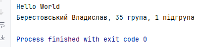

### Завдання 1 (03.03.2025)

**Мета і завдання:** 
1. Підготувати сховище до розміщення проекту
2. Написати просту консольну програму (наприклад вивід на екран аргументів командної строки)

**Приклад запуску:**

**Код:**
[code](code)

