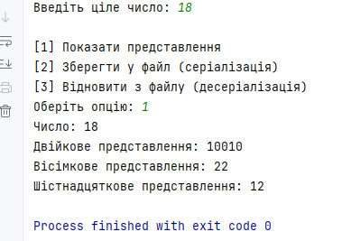

### Завдання 2 - Класи та об'єкти (04.03.2025)

**Мета і завдання:**
1. Розробити клас, що серіалізується, для зберігання параметрів і результатів обчислень.
   Використовуючи агрегування, розробити клас для знаходження рішення задачі.
2. Розробити клас для демонстрації в діалоговому режимі збереження та відновлення стану об'єкта, використовуючи серіалізацію. Показати особливості використання transient полів.
3. Розробити клас для тестування коректності результатів обчислень та серіалізації/десеріалізації.
   Використовувати докладні коментарі для автоматичної генерації документації засобами javadoc.
4. Виконати індивідуальне завдання згідно номеру в списку (№2 - Знайти двійкове, вісімкове та шістнадцяткове уявлення цілочисленного значення).

**1. Приклад запуску:**

**Код:** [Main2Ex1.java](code/Main2Ex1.java)

**2. Приклад запуску:**

**Код:** [Main2Ex2.java](code/Main2Ex2.java)

**3. Приклад запуску:**

**Код:** [Main2Ex3.java](code/Main2Ex3.java)

**4. Приклад запуску:**

**Код:** [Main2Ex4.java](code/Main2Ex4.java)

