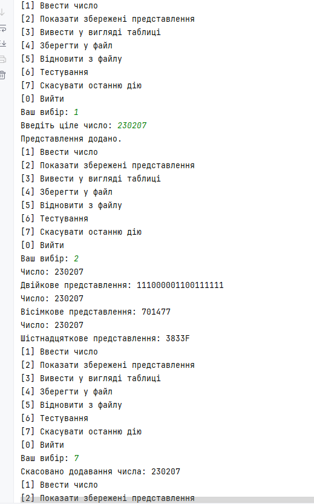

### Завдання 5 - Обробка колекцій (07.03.2025)

**Мета і завдання:**

1. Реалізувати можливість скасування (undo) операцій (команд).
2. Продемонструвати поняття "макрокоманда"
3. При розробці програми використовувати шаблон Singletone.
4. Забезпечити діалоговий інтерфейс із користувачем.
5. Розробити клас для тестування функціональності програми.

**Приклад запуску:**

**Код:** [Main5.java](code/Main5.java)