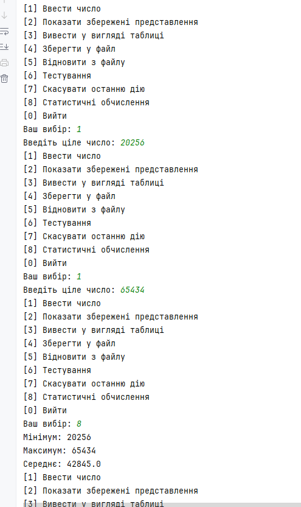

### Завдання 6 - Паралельне виконання (10.03.2025)

**Мета і завдання:**

1. Продемонструвати можливість паралельної обробки елементів колекції (пошук мінімуму, максимуму, обчислення середнього значення, відбір за критерієм, статистична обробка тощо).
2. Управління чергою завдань (команд) реалізувати за допомогою шаблону Worker Thread.

**Приклад запуску:**

**Код:** [ReadmeTask6.md](ReadmeTask6.md)